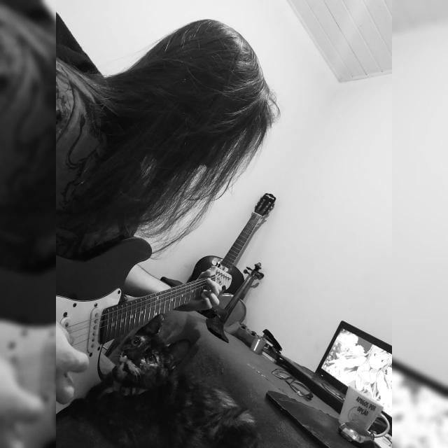
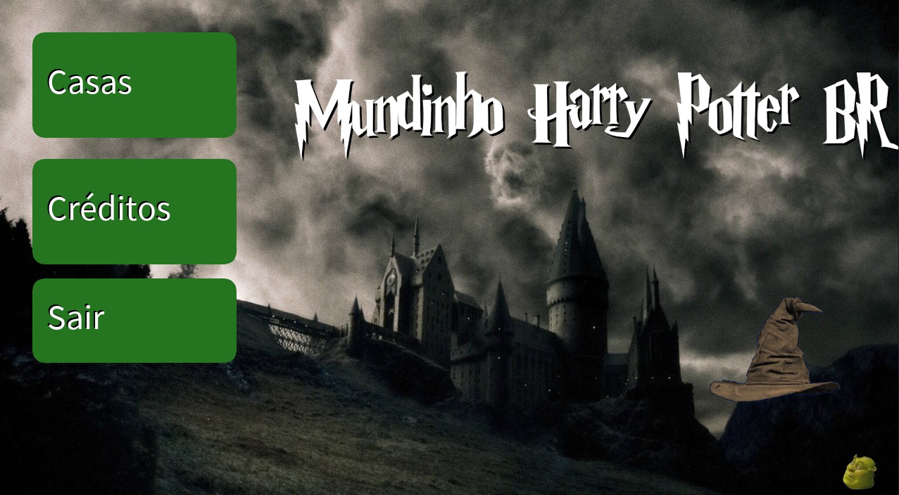
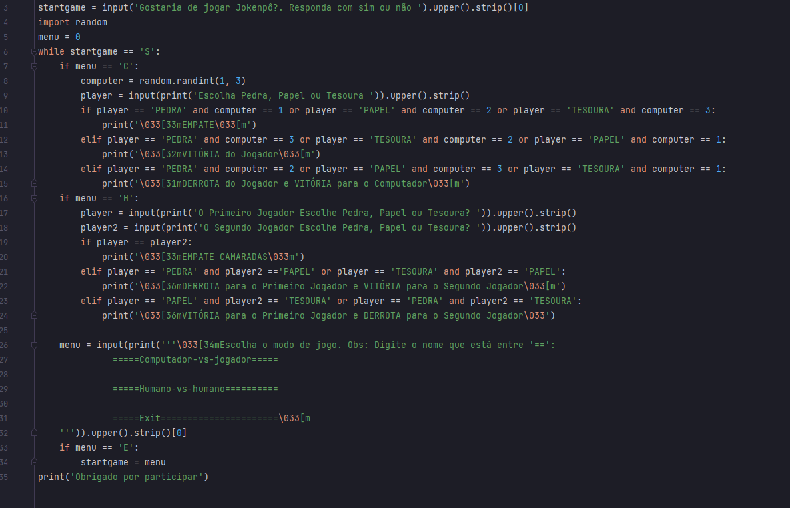
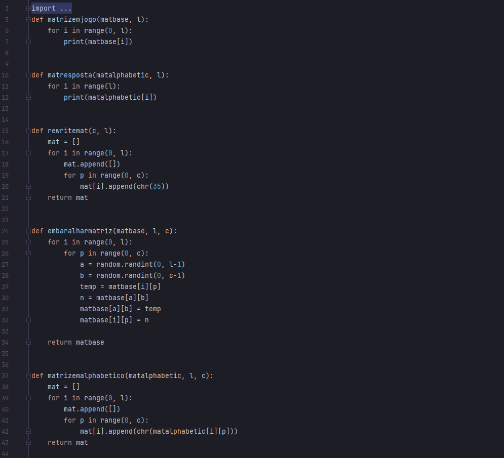
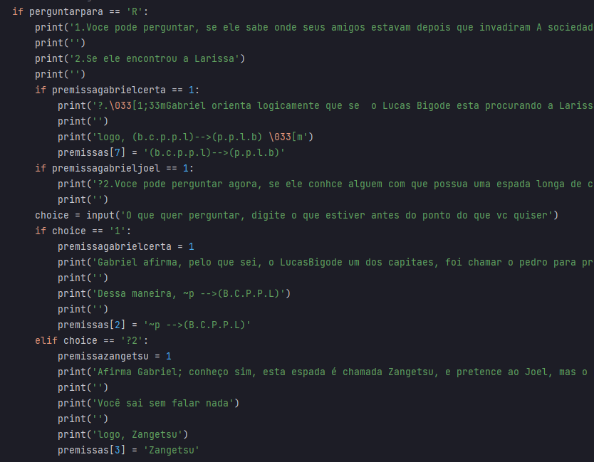
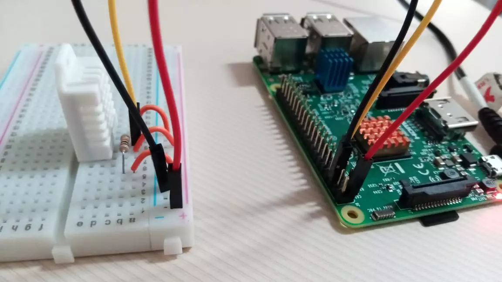
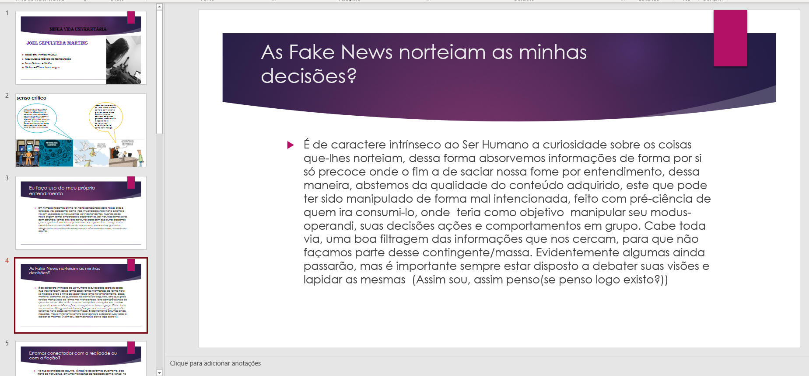

## Portifólio
## Fatos sobre mim
 
 

Sou estudante de Ciência da Computação PUCPR(Pontifícia Universidade Católica do Paraná), completei alguns cursos online e busco completar outros
 Meu objetivo e absorver o máximo de conhecimento e domínio possível na área além de ampliar meu conhecimento em mais de uma língua, em busca de percepções e técnicas que melhorem minha eficiência em todos os aspectos.

### Pojetos Em Experiência Criativa: Navegando na Computação:
 #### Second Nature

 

Este foi um jogo desenvolvido no Construct 3, que tinha como história um detetive desvendando mistérios sobre determinados casos

 #### Mundinho Do Harry Potter BR 

 

Foi um projeto desenvolvido no Processing, através da linguagem Java, que trazia um compilado de informações referente ao mundo de Harry Potter, contendo interfaces de áudio, vídeo, imagens etc.
 
 #### Aplicativo Web
  Desenvolver um site que contenha uma página inicial com MENU que irá redirecionar
 paraoutras4páginas:
 1. Página com imagens
 2. Página com vídeos (youtube)
 3. Página com componentes de input (mínimo 5 campos)
 •Ao clicar em um botão, deverá gravar as informações em uma tabela do banco de 
 dados.
 4. Página de listagem de dados.
 •Ao clicar em um botão, deverá mostrar na página as informações de uma tabela do 
 banco de dados.
 o site deverá ser um TEMA em específico que a equipe 
 escolher.
  
 
 

**Jogo Da Memória: Se resume em criar um código que simule um jogo de memoria, onde se o indivíduo que esta dando os inputs acertar a posição de dois elementos iguais, ira ganhar um ponto, ate finalizar o jogo.

 

### Resolução de Problemas com Lógica Matemática
Em suma o trabalho em destaque desenvolvido, foi a criação de deduções logicas em paralelo com uma história condizente, e também sua implementação em uma linguagem de programação, eu no caso usei Python, essa espécie de jogo, através da manipulação da Matemática Discreta, faria com que o  individuo que estivesse jogando, pudesse inferir uma conclusão em decorrer das premissas dadas, desenvolvi esse jogo com múltiplas escolhas e diálogos.

 

### Fundamentos de Sistemas Ciberfísicos
**O *Projeto Smart City* Implica na criação de uma solução dentro de uma problemática em Smart City, através do Raspberry Pi e seus sensores e atuadores.

 

### FILOSOFIA
Nesta disciplina foi contemplada a visão de mundo de diversos filósofos tais como Emanuel Kant, em especifico sobre ele foi estudado o seu texto 'O que é esclarecimento', teve também filósofos como Michel Montaigne ('De como filosofar é aprender a morrer'), Jean Paul Sartre ("O Existencialismo no Humanismo") entre outros.
Vale destacar o estudo Sobre o "Projeto Educativo De Francisco" e a Construção do Projeto Vida Universitária.

 

### Alguns conhecimentos
*Estudos em HTML, c++, c, Python
*InglêS

### Outros
*Toco e treino Violão, Violino e guitarra
*Planejo aprender futuramente Piano

